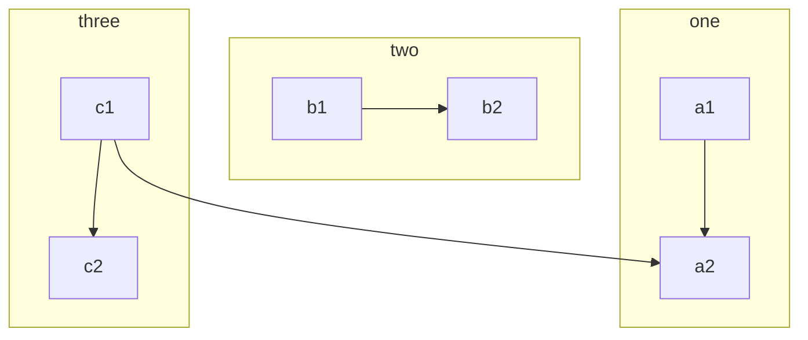

## 主流框架研究思考
### 基础工具
[GitDoc编写规则](https://docs.github.com/zh/get-started/writing-on-github/getting-started-with-writing-and-formatting-on-github/quickstart-for-writing-on-github)

[Markdown 图表的创建和动态修改](https://github.com/mermaid-js/mermaid/blob/develop/README.zh-CN.md)

