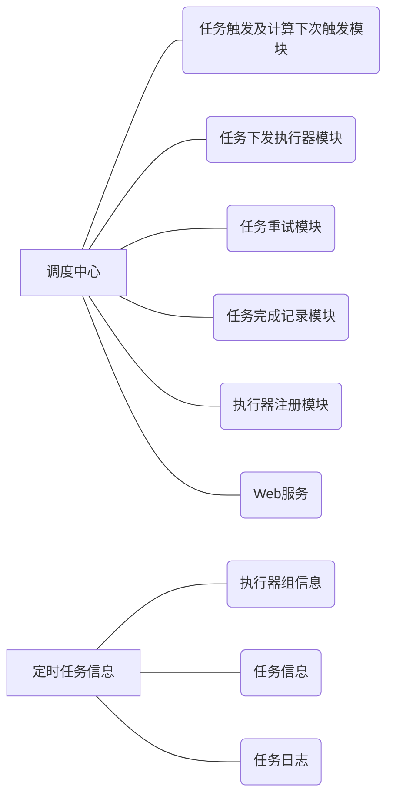
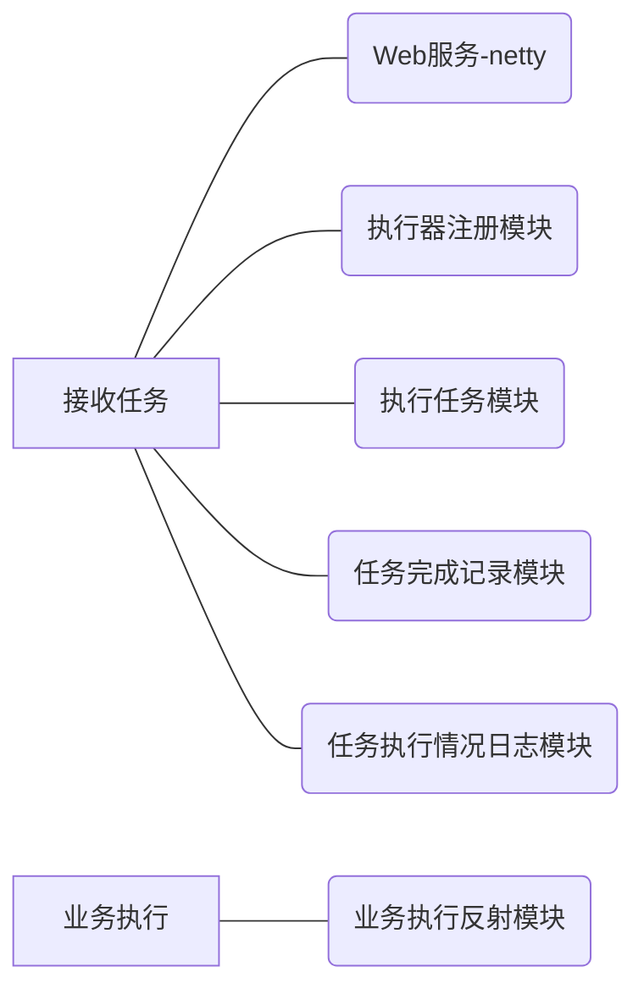

## 模块拆分

### 调度中心

```mermaid
flowchart LR
    A[调度中心] --- A1(任务触发及计算下次触发模块)
    A --- A2(任务下发执行器模块)
    A --- A3(任务重试模块)
    A --- A4(任务完成记录模块)
    A --- A5(执行器注册模块)
    A --- A6(Web服务)
    
    B[定时任务信息] --- B1(执行器组信息)
    B --- B2(任务信息)
    B --- B3(任务日志)
```
### 执行器

```mermaid
flowchart LR
    A[接收任务] --- A1("Web服务-netty")
    A --- A2(执行器注册模块)
    A --- A3(执行任务模块)
    A --- A4(任务完成记录模块)
    A --- A5(任务执行情况日志模块)

    B[业务执行] --- B1(业务执行反射模块)
```